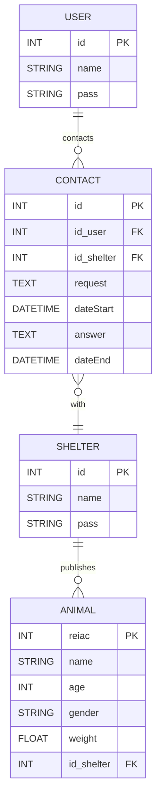

## 📌 Relational Schema Description

This diagram represents the structure of the database with five main tables:

- **USER**: Stores user information.
- **SHELTER**: Represents animal shelters.
- **ANIMAL**: Contains data about each animal and the shelter it belongs to.
- **CONTACT**: Records the contacts initiated by users with shelters.
- **ANSWER**: Stores the responses from shelters to users.

---

---

📌 **Summary of relationships:**  
- A user **can view multiple animals**.  
- A user **can contact multiple shelters** and **vice versa**.  
- A shelter **can respond to multiple users**.  
- A shelter **can publish multiple animals**, but each animal **belong to only one shelter**.  

